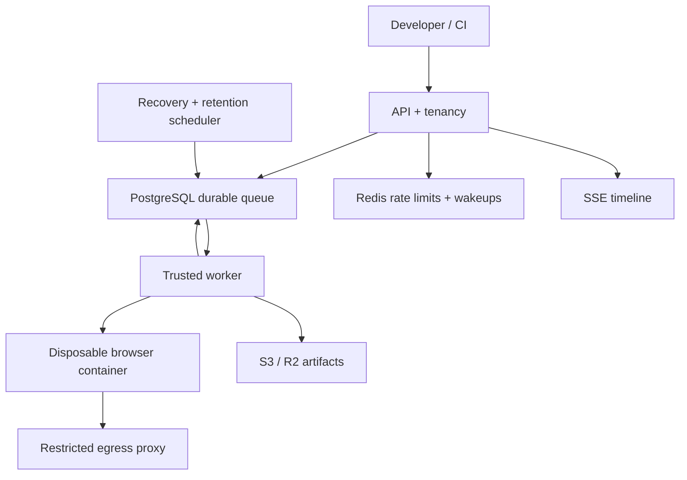

# BrowserGrid

Self-hosted browser execution infrastructure: a FastAPI control plane, a transactional job queue, disposable Docker browser sandboxes, and a Next.js operations dashboard.

**Status: initial implementation, not a production release.** No execution results are fabricated. The control-plane tests and dashboard build have been validated; the Docker browser path is implemented but has not been run in the authoring environment. See [validation evidence](docs/VALIDATION.md) and [delivery scope](docs/ROADMAP.md) before deploying.

## Local setup

Requirements: Linux x86_64, Docker Engine with Compose v2, rootful Engine, host networking/NET_ADMIN and iptables/ip6tables, supported user namespaces/seccomp, at least 8 GB RAM and 15 GB available disk. The daemon must support tmpfs, PID/memory/CPU limits and container init. Browser images are large.

```bash
cp .env.example .env
docker compose up --build
```

Open **http://localhost:3000**, register with a password of at least 12 characters, create a workspace and project, then choose **New run**. The inline example exercises the included fixture. Select Chromium first; acceptance of that path is the gate before enabling the remaining matrix.

- Dashboard: http://localhost:3000
- API docs: http://localhost:8000/docs
- MinIO console: http://localhost:9001
- Default credentials in `.env.example` are explicitly local-only development defaults.
- The init service runs migrations, creates the object bucket, and generates a persistent encryption key. It never resets existing data.
- Workspace concurrency defaults to two jobs; the daily cap defaults to 100 jobs. A matrix consumes one quota unit per browser × viewport job.

## Architecture



The API never evaluates uploaded or inline code. A trusted worker owns Docker access; execution containers have no Docker socket, host mounts or control-plane credentials. Sandboxes run as UID 1000 with a read-only root filesystem, a dedicated internal network, a proxy that denies private destinations, a separate host firewall guard, seccomp, dropped capabilities and resource limits. See [security model](docs/SECURITY.md).

## Execution and sources

- Inline Playwright tests: run within the sandbox, with automatic console/network instrumentation.
- Public GitHub repositories: require an exact 40-character SHA, a committed `package-lock.json`, and `@playwright/test` version **1.58.2** matching the runtime image.
- ZIP bundles: uploaded through the API, with path, expansion, symlink and size validation before execution. Include `package.json`, `package-lock.json` and `tests/`. Uploads reserve cleanup metadata first and become executable only after storage acknowledgment; failed reservations are cleaned after one hour.
- Browser matrix: Chromium, Firefox and WebKit; up to four configurable viewports, up to 12 jobs per run.
- Command is an argument array, not an API-server shell command. Default: pinned Playwright runner.
- User Playwright config is loaded inside the sandbox, then matrix, reporter, output directory and BrowserGrid capture options are enforced.
- Repository dependency installation uses `npm ci --ignore-scripts`. Repositories requiring native/install scripts are not supported in this first version.

Each job records its state transitions, worker ID, immutable source SHA, viewport, runtime image, worker version, Playwright version and actual launched browser version. Results are read from the real Playwright JSON report; incomplete/setup failures cannot be marked passed. A signalled or invalid command exit never becomes exit zero. Ordinary logs are bounded by count and bytes, with explicit truncation in the realtime timeline.

For bundle/repository console and network collection, import the instrumented fixture:

```ts
import { test, expect } from "@browsergrid/test";
```

BrowserGrid injects this module in the sandbox. For local authoring, use the package in `packages/browser-sdk` with a matching Playwright installation. Standard `@playwright/test` tests still collect Playwright screenshots, video and traces, but do not automatically use the instrumented page fixture. Query strings and request bodies are omitted from network metadata.

## API and CI

The API is versioned at `/api/v1`; live OpenAPI documents exact schemas. Cookie mutations require an explicit allowed Origin. CI should use workspace API keys instead of browser sessions.

Create a key as an Owner/Admin through `POST /api/v1/workspaces/{workspace_id}/api-keys`, using a JSON body such as:

```json
{"name":"CI","scopes":["runs:read","runs:write","artifacts:read"],"expires_days":30}
```

The token is shown once, persisted as a SHA-256 digest, revocable and expiration-bound. Membership and scopes are both enforced server-side.

```bash
export BROWSERGRID_URL=http://localhost:8000
export BROWSERGRID_TOKEN='<workspace API key>'
browsergrid run run.json --idempotency-key github-run-123 --wait
browsergrid view '<run UUID>'
browsergrid cancel '<run UUID>'
browsergrid artifacts '<run UUID>'
```

`run.json`:

```json
{
  "project_id": "<project UUID>",
  "config": {
    "source": {
      "type": "inline",
      "code": "import {test,expect} from '@playwright/test'; test('fixture',async({page})=>{await page.goto('http://fixture-app:8080');await expect(page).toHaveTitle('BrowserGrid Fixture');});"
    },
    "browsers": ["chromium"],
    "viewports": [{"name":"desktop","width":1440,"height":900}],
    "video":"on",
    "trace":"on"
  }
}
```

`POST /api/v1/runs` accepts `Idempotency-Key`; a repeated key with a different request returns 409. The SSE endpoint supports event cursor replay. Artifact downloads require authorization and return a 120-second signed URL with attachment disposition.

## Development and tests

```bash
python -m venv .venv
. .venv/bin/activate
make install
make test
make lint
# With the Compose stack running:
make e2e
```

Runtime contract checks: `cd runtimes && npm ci && node --test tests/*.test.cjs`. These verify actual test discovery without launching a browser.

The real E2E script creates an account, workspace and project, runs the actual browser matrix, checks test reports and downloaded screenshot/video/trace files, uploads and executes a ZIP bundle with a verified PNG artifact, exercises an intentional test failure and active-run cancellation with sandbox removal verification. It contains no browser mocks. The disposable network acceptance script adds positive-control host/DNAT canaries and metadata proxy denial; the recovery script tests worker loss and independent timeout enforcement. CI is configured to run these paths on a Docker-enabled Linux runner; the workflow has not been run remotely yet.

Do not mark phase 2 complete until the real Docker E2E passes. Do not expose this early implementation to hostile users; the roadmap separates implemented paths from remaining production requirements.

## Further reading

- [Architecture](docs/ARCHITECTURE.md)
- [Security](docs/SECURITY.md)
- [Deployment](docs/DEPLOYMENT.md)
- [Validation evidence](docs/VALIDATION.md)
- [Remaining scope and acceptance gates](docs/ROADMAP.md)
