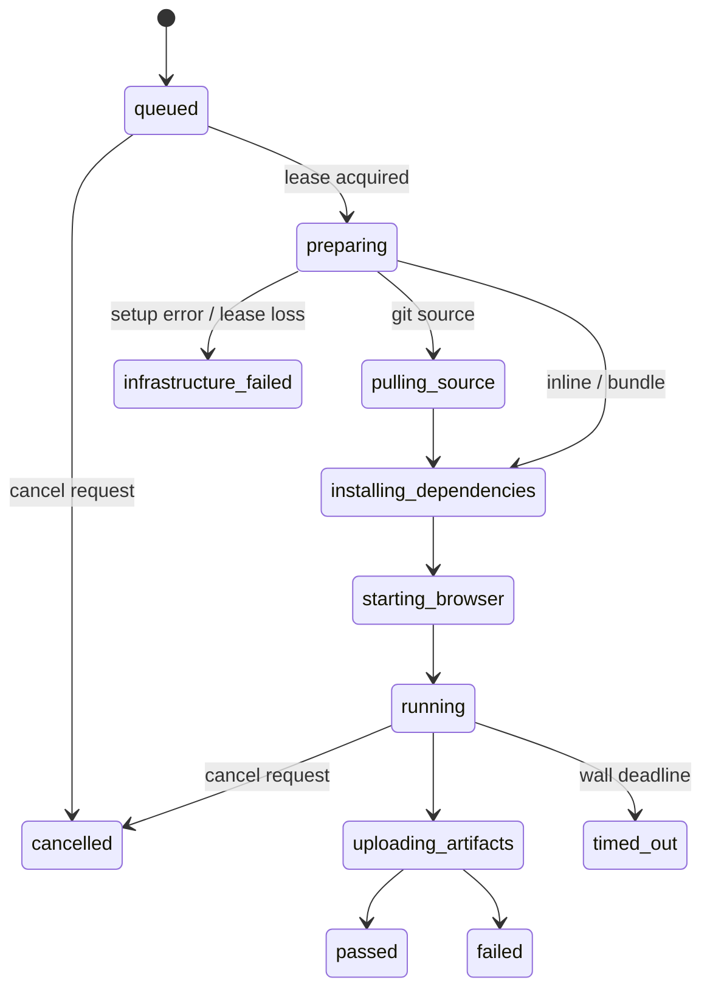

# Architecture

## Control plane

FastAPI handles accounts, opaque database-backed browser sessions, workspace membership, project creation, encrypted project secrets, scoped API keys, validated source bundles, run creation and read authorization. Next.js serves the dashboard and forwards same-origin API requests. PostgreSQL stores all durable run and tenant state. Redis handles atomic write rate limits and best-effort worker wake-ups.

The implementation uses a **PostgreSQL job queue**, not Celery. Queue notifications are intentionally disposable; missed Redis notifications do not lose jobs. This keeps job acquisition, quotas and cancellation inside the same transactional data boundary. Workers recheck the queue after a bounded wait.

Source code lives in the shared `browsergrid` Python package; `apps/api`, `apps/worker` and `apps/scheduler` expose service entry points. Database migrations are in `packages/db`; the TypeScript instrumentation fixture lives in `packages/browser-sdk`. The browser runtime supplies the entry script and reporter, and versioned metadata references all three browser engines in a single Playwright image.

## Job lifecycle

The authoritative transition map also allows cancellation, timeout and infrastructure failure from every active state. Transitions write events in the same transaction as state updates. A run aggregates all matrix jobs and ends only once every job is terminal.

## Concurrency and leases

Creation locks the workspace row before enforcing the daily job quota and inserting matrix jobs. Acquisition orders eligible workspaces by their oldest queued job, locks one workspace with `FOR UPDATE SKIP LOCKED`, rechecks active-job capacity and takes its earliest queued job. Busy/locked tenants do not need to block unrelated claims. Worker registration handles unique-ID races inside a savepoint; an ID assigned to an active job cannot claim another. Recovery locks one active tenant per transaction and releases its lock before the next tenant. Cancellation and worker result transitions use the same workspace locking boundary.

A job receives a random lease token. Workers heartbeat every three seconds; the scheduler expires leases after 45 seconds. Result writes recheck the lease. A worker that loses its lease cannot overwrite the recovery decision. Worker loss currently becomes `infrastructure_failed` rather than being automatically retried; user-level Playwright retries remain visible in test results.

SQLite tests check state logic but cannot establish PostgreSQL lock semantics. Seven isolated-schema PostgreSQL contention/fencing tests are provided and form a required acceptance gate.

## Execution plane

The Docker backend creates a non-root sandbox on a dedicated internal bridge. A proxy on that bridge has public-network access; execution containers themselves do not. The fixture application is the only intentionally allowed private target in local development. Production must remove that exception or explicitly scope it to a controlled test application.

Source files and configuration stream through a bounded non-root tar exec into the writable tmpfs, without host bind mounts. Docker archive access cannot write into this sandbox's read-only rootfs. Input files and parent directories are owned by UID 1000. A final readiness sentinel prevents the runtime from reading incomplete source input.

The runtime fetches an exact public GitHub commit or consumes a validated ZIP, installs lockfile dependencies without install scripts, builds an enforced Playwright configuration, probes a real browser launch, and invokes the project-local Playwright command for repositories/bundles. The instrumentation fixture resolves that same physical dependency to avoid loading a second Playwright instance. A custom reporter emits bounded structured timeline events. Test output and browser metadata are persisted by the trusted worker.

A completed sandbox stays alive until the worker retrieves artifacts: stopping the container first would unmount tmpfs and destroy its output. The worker removes it in a `finally` block. A periodic worker reaper removes labelled sandboxes whose database lease is terminal or invalid. An independent engine watchdog removes containers at their deadline even if all workers stop. It has no network/database/storage access. The scheduler fences expired job deadlines separately from heartbeat-loss recovery.

## Artifacts and realtime

PostgreSQL holds artifact metadata; S3-compatible storage holds binary content. Artifact extraction rejects TAR traversal, links and special files, and bounds both transport and individual files. Text artifacts receive best-effort secret masking. Binary screenshots, video and traces cannot be reliably redacted.

SSE reads a bounded page of ordered events, closes each DB transaction before waiting, accepts cursor replay and rechecks tenant membership/session/key validity during streaming. The dashboard never fabricates execution records. Currently browser telemetry is stored as private JSON artifacts; the dashboard offers downloads rather than a full DevTools-style inspector.

Retention deletes the remote object before deleting its metadata, so storage deletion failures remain retryable. Source ZIP uploads reserve pending bundle metadata before writing their private object. After acknowledgment, a row-locked completion marks the source ready and clears its reservation expiry; pending or expired sources cannot create runs. The worker independently checks readiness and project ownership. Abandoned pending uploads expire after one hour; successful sources remain available for reruns. Uploads reserve hidden artifact metadata before writing objects; failed or interrupted uploads expire after one hour. Workspace locks are released during uploads, allowing cancellation to proceed. Completed artifacts become readable only after upload acknowledgment. General project/workspace deletion and a historical orphan reconciliation pass are not implemented yet.

## Scaling

Each trusted worker process runs one sandbox at a time. Run additional worker replicas for more concurrent jobs. Each node needs PostgreSQL, Redis and S3 connectivity, a compatible Docker engine, the pinned runtime image and an isolated sandbox bridge plus egress proxy. No local source/artifact directory is shared between nodes. Key distribution for trusted workers is an explicit operator responsibility; never distribute it to execution sandboxes.

The `ExecutionBackend` interface separates lifecycle operations from Docker. Kubernetes/remote backends are deliberately not implemented.
